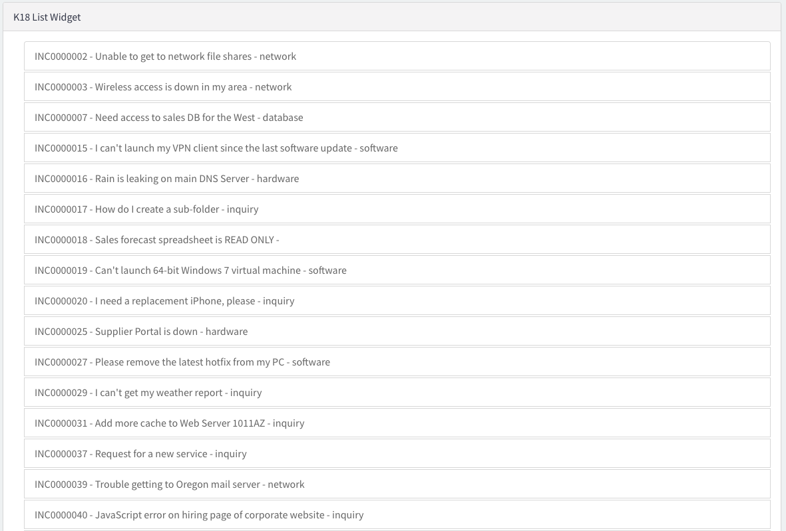

# Create list widget

## Goal

In this lab we will create a list widget and then we will modify it to load data client side.

## Log on to Your Training Instance.

1. Navigate to the unique instance URL provided to you.

1. Log on with provided credentials.

## Create List Widget

1. Navigate to Service Portal > Service Portal Configuration. 

1. Select Widget Editor

1. Select Create a new widget

    

1. Enter the following information:
    - Widget Name: k18_list_widget
    - Widget ID: k18_list_widget
    - Create Test Page: checked
    - Page Id: k18_list_widget

1. Click the Submit button.

1. Your Screen should look like this

    

## Load Data From Server Side

1. Enter the following information in the Server Script Window:

    ```javascript
    (function () {
            /* populate the 'data' object */
            /* e.g., data.table = $sp.getValue('table'); */

            //define the variable to hold our list	
            data.list = [];

            //Query the table
            var gr = new GlideRecord('incident');
            gr.addQuery('active', true);
            gr.query()
            while (gr.next()) {
                //load values into object
                var record_obj = {};
                record_obj.number = gr.number.getDisplayValue();
                record_obj.short_description = gr.short_description.getDisplayValue();
                record_obj.priority = gr.priority.getDisplayValue();
                record_obj.category = gr.category.getDisplayValue();
                //add object to the list  
                data.list.push(record_obj);
            }
        })();
    ```
1. Enter the following information in the HTML template box

    ```html
    <div class="panel panel-default">
    <!-- your widget template -->
    <div class="panel-heading">
        K18 List Widget
    </div>
    <div class="panel-body">
        <ul class="list-group">
    <li class="list-group-item" ng-repeat="item in c.data.list">{{item.number}} - {{item.short_description}} - {{item.priority}}</li>
    </ul>
        </div>
    </div>
    ```
1. Click Save

1. Navigate to [your instance] .service-now.com/sp_config/?id=k18_list_widget and check your results

    

## Load Data From Client Side

1. Navigate back to the widget editor

1. Modify the Server Script to look like this

    ```javascript
    (function() {
        /* populate the 'data' object */
        /* e.g., data.table = $sp.getValue('table'); */

        if(input){
            //define the variable to hold our list
            data.list = [];
            
            //Query the table
        var gr = new GlideRecord('incident');
        gr.addQuery('active', true);
        gr.query()
        while (gr.next()) {
                //load values into object
                var record_obj = {};
                record_obj.number = gr.number.getDisplayValue();
                record_obj.short_description = gr.short_description.getDisplayValue();
                record_obj.priority = gr.priority.getDisplayValue();
                record_obj.category = gr.category.getDisplayValue();
        //add object to the list  
                data.list.push(record_obj);
        }
        }
    })();
    ```
1. Enter the following information in the Client Script

    ```javascript
    function($scope) {
    /* widget controller */
    var c = this;
        c.data.loading = true;
        
        $scope.server.update().then(function(){
            c.data.loading = false;
        })
    }
    ```
1. Modify the html template to look like this

    ```html
    <div class="panel panel-default">
    <!-- your widget template -->
    <div class="panel-heading">
        K18 List Widget
    </div>
    <div class="panel-body">
    <span ng-if="c.data.loading"><i  class="fa fa-spinner fa-spin fa-3x fa-fw"></i>
        <span class="sr-only">Loading...</span></span>
        <ul class="list-group">
    <li class="list-group-item" ng-repeat="item in c.data.list">{{item.number}} - {{item.short_description}} - {{item.priority}}</li>
    </ul>
        </div>
    </div>
    ```
1. Click Save

1. Navigate to [your instance] .service-now.com/sp_config/?id=k18_list_widget and check your results

# REST API

## Lab Goal

In this lab we will modify our list widget to make use of the REST API.

# Modify List Widget.

1. Navigate to the widget editor and open the k18_list_widget.

1. Modify the Server Script to look like this

    ```Javascript
    (function() {
        /* populate the 'data' object */
        /* e.g., data.table = $sp.getValue('table'); */	
    })();
    ```
1. Modify the Client Script to look like this:

    ```javascript
    function($scope,$http) {
    /* widget controller */
    var c = this;
        c.data.loading = true;
        
        $http.get('/api/now/table/incident?sysparm_query=active%3Dtrue').success(function(response){
            c.data.loading=false;
            c.data.list = response.result;
        })
    }
    ```
1. Click Save 

1. Navigate to [your instance] .service-now.com/sp_config/?id=k18_list_widget and check your results

# NG Template

## Lab Goal

In this lab we create 2 ng-templates to be used by our widgets

## Create Templates.

1. Navigate to Service Portal > Widgets

1. Open the k18_list_widget.

1. Scroll to the bottom and select the Angular ng-templates tab

1. Click New

1. Enter the following information
    - ID: task-priority
    - Template:

    ```html
    <span>{{item.number}} - {{item.short_description}} - {{item.priority}}</span>
    ```

1. Click Submit

1. Scroll to the bottom and select the Angular ng-templates tab

1. Click New
 
1. Enter the following information
    - ID: task-category
    - Template:

    ```html
    <span>{{item.number}} - {{item.short_description}} - {{item.category}}</span>
    ```

1. Click Submit

## Update List widget

1. Open the k18_list_widget using the widget editor
    NOTE:If it's already not open in a new tab: Service Portal > Service Portal Configuration > Widget Editor > Select from the Recently Update

1. Modify the HTML template to look like this
    ```html
    <div class="panel panel-default">
    <!-- your widget template -->
    <div class="panel-heading">
        K18 List Widget
    </div>
    <div class="panel-body">
    <span ng-if="c.data.loading"><i  class="fa fa-spinner fa-spin fa-3x fa-fw"></i>
        <span class="sr-only">Loading...</span></span>
        <ul class="list-group">
    <li class="list-group-item" ng-repeat="item in c.data.list" ng-include="'task-category'"></li>
    </ul>
        </div>
    </div>
    ```
1. Click Save

1. Navigate to [your instance] .service-now.com/sp_config/?id=k18_list_widget and check your results

    

# Widget Options

## Lab Goal
In this lab we will define options for our widget 

## Add out of box options
1. Navigate to Service Portal > Widgets

1. Open the k18_list_widget.

1. Click on the lock icon next to the Fields field
    

1. Add the following fields:
    - Title
    - Bootstrap Color
1. Click Update

## Modify list widget

1. Open the k18_list_widget using the widget editor. 
    NOTE: If you had the editor open, refresh it before continuing.

1. Click on the  icon in the top right corner

1. Select Edit Option Schema

1. Click on the  icon in the top right corner on of the modal window

    

1. Enter the following information
    - Label: Table
    - Name: table
    - Type: String
    - Default Value: incident

1. Click on the  icon in the top right corner on of the modal window

1. Enter the following information
    - Label: Query
    - Name: query
    - Type: string
    - Default Value: leave empty
1. Click on the  icon in the top right corner on of the modal window

1. Enter the following information
    - Label: Template
    - Name: template
    - Type: string
    - Default Value: leave empty
1. Click Save

1. Modify Client Script to look like this

    ```javascript
    function($scope,$http) {
    /* widget controller */
    var c = this;
        c.data.loading = true;
        c.data.table = c.options.table || "incident";
        c.data.query = c.options.query || "";
        c.data.template = c.options.template || "task-category";
        $http.get('/api/now/table/'+c.data.table+'?sysparm_query='+c.data.query).success(function(response){
            c.data.loading=false;
            c.data.list = response.result;
        })
    }
    ```

1. Modify HTML Template to look like this

    ```html
    <div class="panel panel-{{c.options.color}}">
    <!-- your widget template -->
    <div class="panel-heading">
        {{c.options.title}}
    </div>
    <div class="panel-body">
    <span ng-if="c.data.loading"><i  class="fa fa-spinner fa-spin fa-3x fa-fw"></i>
        <span class="sr-only">Loading...</span></span>
        <ul class="list-group">
    <li class="list-group-item" ng-repeat="item in c.data.list" ng-include="c.data.template"></li>
    </ul>
        </div>
    </div>
    ```

1. Click Save

1. Navigate to [your instance] .service-now.com/sp_config/?id=k18_list_widget

1. Press "Control" right click on top of your widget

1. Select Instance Options

    

1. Enter the following information

    

1. Click Save

1. Check your results

    

# Record Watchers

## Lab Goal

In this lab we will create a Record Watcher so our widget is automatically updated without having to refresh the page 

## Set up record watcher

1. Open the k18_list_widget using the widget editor. 

1. Modify the Client Script to look like this:

    ```javascript
    function($scope,$http,snRecordWatcher) {
    /* widget controller */
    var c = this;
        c.data.loading = true;
        c.data.table = c.options.table || "incident";
        c.data.query = c.options.query || "";
        c.data.template = c.options.template || "task-category";
        function getData(){
        $http.get('/api/now/table/'+c.data.table+'?sysparm_query='+c.data.query).success(function(response){
            c.data.loading=false;
            c.data.list = response.result;
        })
        }
        getData();
        
        snRecordWatcher.initList(c.data.table, c.data.query);
        $scope.$on('record.updated', function(name, data) {
            getData();
        });
    }
    ```

1. Click Save

1. Navigate to [your instance] .service-now.com/sp_config/?id=k18_list_widget

1. How Many Changes are displayed?

1. Open a new window and open a new critical priority change request.

1. Go back to your widget window, is the new change request now showing?

# Broadcast events

## Lab Goal

In this lab we will modify our widget to broadcast an event and have another widget receive that event. 

## Set up event

1. Open the k18_list_widget using the widget editor. 

1. Modify the Client Script to look like this:

    ```javascript
    function($scope,$http,snRecordWatcher,$rootScope) {
    /* widget controller */
    var c = this;
        c.data.loading = true;
        c.data.table = c.options.table || "incident";
        c.data.query = c.options.query || "";
        c.data.template = c.options.template || "task-category";
        function getData(){
        $http.get('/api/now/table/'+c.data.table+'?sysparm_query='+c.data.query).success(function(response){
            c.data.loading=false;
            c.data.list = response.result;
            $rootScope.$broadcast("K18ListWidgetUpdated",c.data.list);
        })
        }
        getData();
        
        snRecordWatcher.initList(c.data.table, c.data.query);
        $scope.$on('record.updated', function(name, data) {
            getData();
        });
    }
    ```

1. Click Save

1. Click 

1. Select Create New Widget

1. Enter the following information:
    - Widget Name: k18_count_display_widget
    - Widget ID: k18_count_display_widget

1. Click Submit

1. Enter the following code in the HTML Template Field:

    ```html
    <div>
    <!-- your widget template -->
    <h2 class="jumbotron">
        Total Records:{{c.data.count}}
    </h2>
    </div>
    ```

1. Enter the following code in the Client Script field:

    ```javascript
    function($scope) {
    /* widget controller */
    var c = this;
        c.data.count = 0;
        
        $scope.$on("K18ListWidgetUpdated",function(evt,results){
            console.log(results)
            c.data.count = results.length;
        })
    }
    ```

1. Click Save

1. Click on the Designer Option in widget header menu

    

1. Use the filter to look for k18_list_widget Test Page

1. Select the Page

1. Use the filter to search for k18_count_display_widget

    

1. Drag and drop k18_count_display_widget above the k18 List Widget

1. Navigate to [your instance] .service-now.com/sp_config/?id=k18_list_widget

1. Is the count of records populating?

